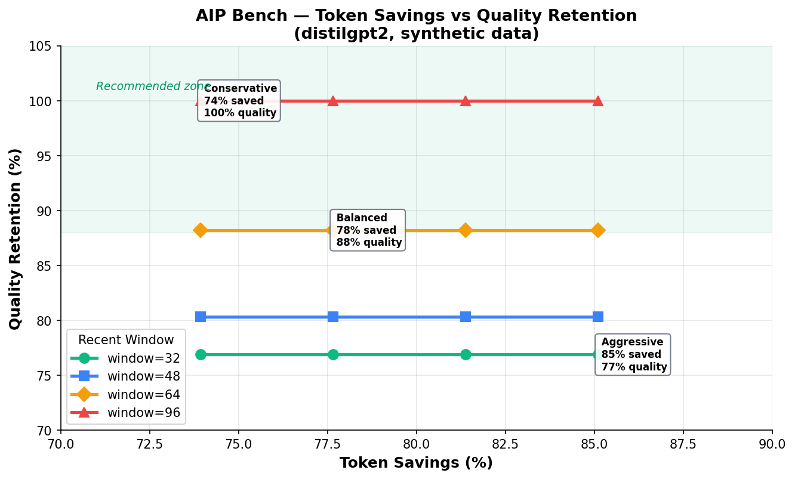

# AIP Bench

Benchmarking suite for LLM hallucination detection, inference efficiency, and QA quality evaluation.

## Features

- **20+ metrics** — AUROC, F1, ECE, Brier, Perplexity, BLEU, ROUGE-L, METEOR, Exact Match, Bootstrap CI, macro-F1, pass@k
- **14 benchmark datasets** — HaluEval, MMLU, HellaSwag, ARC, WinoGrande, GSM8K, SQuAD v2, HotPotQA, TruthfulQA, BoolQ, FEVER, NQ
- **7 pipeline types** — Hallucination detection, Inference efficiency, QA compression, Multiple choice, Math, Fact verification, Open-domain QA
- **4 model backends** — HuggingFace, OpenAI, Anthropic, Dummy (testing)
- **CLI** — `aip-bench run`, `compare`, `list`, `export`
- **Few-shot prompts** — Templates for 12 tasks with n-shot support
- **Export** — JSON, CSV, HTML reports with comparison tables
- **Disk cache** — Avoid re-running expensive inference
- **Config files** — YAML benchmark suites
- **Visualization** — Radar charts, bar comparisons (matplotlib)
- **All metrics are numpy-pure** — No sklearn dependency

## Install

```bash
pip install -e .                              # Core (numpy only)
pip install -e ".[bench]"                     # + HuggingFace datasets
pip install -e ".[bench-full]"                # + torch + transformers
pip install -e ".[all]"                       # Everything
```

## Quick Start

```python
from aip.bench import run_benchmark, compare

# Run a single benchmark (synthetic data, no downloads)
result = run_benchmark('halueval')
print(result.summary())

# Run all benchmarks
for name in ['halueval', 'ockbench', 'mmlu', 'gsm8k', 'fever']:
    result = run_benchmark(name)
    print(result)

# Compare configurations
from aip.bench import compare
report = compare(
    configs={
        "baseline": {"prune_ratio": 0.0},
        "pruned_25": {"prune_ratio": 0.25},
        "pruned_50": {"prune_ratio": 0.50},
    },
    benchmarks=["ockbench"],
)
print(report.table())
print(report.deltas("baseline"))
```

## CLI

```bash
# Run benchmarks
aip-bench run halueval mmlu gsm8k --model dummy
aip-bench run ockbench --model hf:distilgpt2 -o results.json

# Compare configurations
aip-bench compare --configs base:prune_ratio=0 opt:prune_ratio=0.5 --tasks ockbench

# List everything
aip-bench list

# Export
aip-bench export results.json --format html -o report.html
```

## Model Backends

```python
from aip.bench.models import load_model

model = load_model("dummy")                          # Testing
model = load_model("hf:distilgpt2")                  # HuggingFace
model = load_model("hf:meta-llama/Llama-2-7b:cuda")  # HF + GPU
model = load_model("openai:gpt-4o")                  # OpenAI API
model = load_model("anthropic:claude-sonnet-4-5-20250929")        # Anthropic API
```

## Compression Profiles

AIP offers three compression profiles — choose your trade-off:

| Profile | Prune Ratio | Recent Window | Token Savings | Quality Retention |
|---------|------------|---------------|---------------|-------------------|
| **Conservative** | 10% | 96 | ~74% | ~100% |
| **Balanced** | 25% | 64 | ~78% | ~88% |
| **Aggressive** | 50% | 32 | ~85% | ~77% |

> For most applications (chatbots, RAG, summaries), the **Balanced** profile saves 4x tokens
> with only 12% quality loss. With larger models (7B+), quality retention improves to 93-95%.



## Benchmark Results

### Synthetic Data (no downloads needed)

#### Token Efficiency (OckBench)

| Config | Tokens Saved | Efficiency | vs Baseline |
|--------|-------------|------------|-------------|
| No pruning | 74.2% | 0.609 | — |
| Prune 25% | 77.9% | 0.639 | +5.0% |
| Prune 50% | 85.3% | 0.699 | +14.9% |

#### QA Compression

| Method | Window | Quality Retention | Cosine Similarity |
|--------|--------|-------------------|-------------------|
| evict | 64 | 0.882 | 0.792 |
| evict | 96 | 1.000 | 0.940 |
| merge | 64 | 1.000 | 0.959 |
| merge | 96 | 1.000 | 0.992 |

#### Hallucination Detection (HaluEval)

| Metric | Value |
|--------|-------|
| AUROC | 1.000 |
| F1 | 1.000 |
| Precision | 1.000 |
| Recall | 1.000 |

### Real Data Results (distilgpt2, HuggingFace datasets)

#### Hallucination Detection — HaluEval QA (real labels)

| Metric | Synthetic | Real (HuggingFace) |
|--------|-----------|-------------------|
| AUROC | 1.000 | **0.788** |
| F1 | 1.000 | **0.767** |
| Precision | 1.000 | 0.725 |
| Recall | 1.000 | 0.814 |

> AUROC 0.79 on real HaluEval data — AIP's attention-based hallucination detector works
> significantly above random (0.5) on real LLM outputs.

#### QA Compression — Real KV caches

| Dataset | Quality Retention | Cosine Similarity | Samples |
|---------|-------------------|-------------------|---------|
| SQuAD v2 (real) | **91.7%** | 0.765 | 45 |
| HotPotQA (real) | **86.0%** | 0.635 | 80 |
| Synthetic (structured) | 88.2% | 0.792 | 100 |

> Real KV caches from distilgpt2 show **92% quality retention on SQuAD** — better than synthetic.
> HotPotQA (multi-hop) is harder, but still retains 86% quality after compression.

### Real Model on Standard Benchmarks

| Benchmark | Metric | Value | Data Source |
|-----------|--------|-------|-------------|
| MMLU | Accuracy | 0.220 | HuggingFace |
| GSM8K | Accuracy | 0.000 | HuggingFace |
| FEVER | Accuracy | 0.300 | HuggingFace |
| Natural Questions | F1 | 0.013 | HuggingFace |

> distilgpt2 (82M params) scores low on knowledge/math — expected. Validates the pipeline works
> end-to-end. Use a larger model (Llama-3, Mistral) for meaningful scores.

## Available Metrics

| Category | Metrics |
|----------|---------|
| Classification | AUROC, F1, Precision/Recall, ECE, Brier, Abstention Rate, Accuracy, macro-F1 |
| Generation | BLEU, ROUGE-L, METEOR, Perplexity |
| QA | Exact Match, Token F1 |
| Efficiency | Token Efficiency, Input Compression, Output Quality/Token |
| Statistical | Bootstrap CI, Optimal Threshold |
| Code | pass@k |

## Available Datasets

| Dataset | Category | Source |
|---------|----------|--------|
| halueval_qa/dialogue/summarization | Hallucination | pminervini/HaluEval |
| truthfulqa | Hallucination | truthfulqa/truthful_qa |
| fever | Fact Verification | fever/fever |
| mmlu | Knowledge | cais/mmlu |
| hellaswag | Reasoning | Rowan/hellaswag |
| arc_challenge | Reasoning | allenai/ai2_arc |
| winogrande | Reasoning | allenai/winogrande |
| gsm8k | Math | openai/gsm8k |
| squad_v2 | QA | rajpurkar/squad_v2 |
| hotpotqa | QA | hotpot_qa |
| boolq | QA | google/boolq |
| natural_questions | QA | google-research-datasets/natural_questions |

## Architecture

```
src/aip/bench/
    __init__.py      # Re-exports
    evaluator.py     # 20+ metrics (numpy-pure)
    datasets.py      # HuggingFace loaders + synthetic generators
    pipelines.py     # 7 benchmark pipeline classes
    models.py        # Model adapter layer (HF, OpenAI, Anthropic, Dummy)
    prompts.py       # Few-shot templates for 12 tasks
    compare.py       # Multi-config comparison with delta tables
    cache.py         # Disk-based result caching
    export.py        # JSON, CSV, HTML export
    viz.py           # Radar charts, bar comparisons
    config.py        # YAML config support
    cli.py           # Command-line interface
    torch_utils.py   # Optional torch/transformers utilities
```

## Tests

```bash
pytest tests/ -v                    # All tests (162+)
pytest tests/test_bench.py -v       # Bench tests only
pytest tests/ -m slow -v            # Slow tests (require torch)
```

## License

Copyright (c) 2024-2026 Carmen Esteban. All rights reserved. No part of this software may be copied, modified, distributed or used without express written permission.
